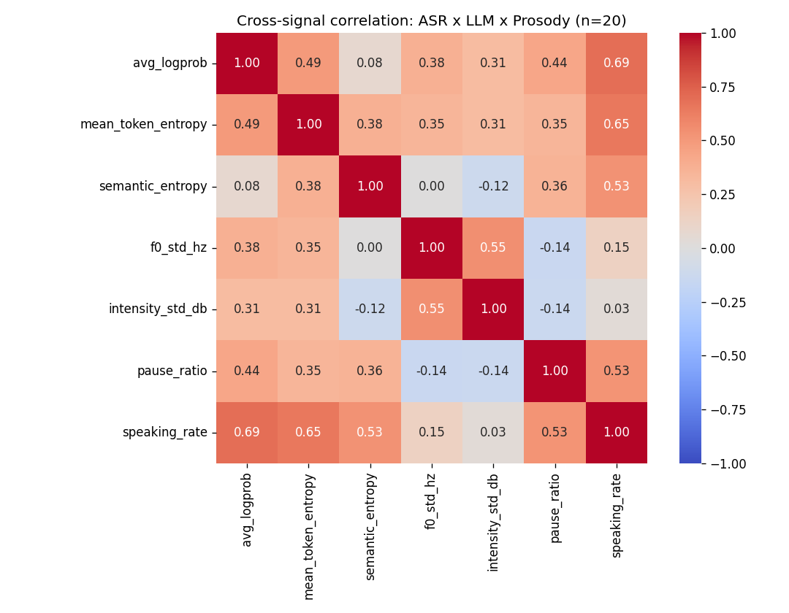
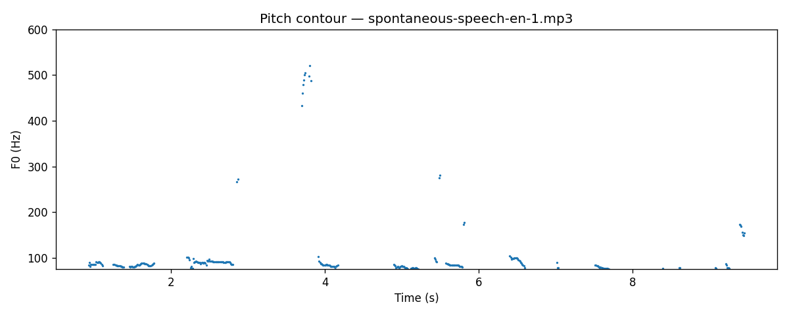

# Dialog Uncertainty Toolkit

> Exploratory toolkit for extracting multi-source uncertainty signals from spoken
> dialogue interactions — combining ASR confidence (Whisper), LLM uncertainty
> (token entropy + semantic entropy), and prosodic features (Praat/Parselmouth).

**Status**: Research prototype · Work in progress · Author: Chayaphon Chaisangkha  
**Done**: Notebooks `01`–`04` — multi-source signal extraction + correlation visuals (see Sample Output).  
**Next (aligned with Master’s proposal)**: `05_intervention_policy.ipynb` — 3-way policy (`AUTO` / `CLARIFY` / `DEFER`), ablations (text-only vs speech-only vs combined), and simple evaluation metrics.

## Motivation

Large Language Model (LLM) based dialogue systems are increasingly deployed in
real-world applications such as customer service, voice assistants, and
human-robot dialogue. In production settings, deciding *when* such systems
should respond autonomously and *when* they should defer to a human reviewer is
a non-trivial design problem with implications for response latency, reviewer
workload, and user trust.

Existing Human-in-the-Loop (HITL) approaches typically rely on a single
uncertainty signal (e.g., token-level model confidence) to drive intervention
decisions. However, in **spoken** dialogue settings, additional signal sources
are available — ASR confidence, semantic uncertainty across multiple sampled
responses, and paralinguistic cues such as prosody and speaking rate — which
remain underexplored as inputs to deferral policies.

This toolkit is a small, reproducible exploration of these signals: it extracts
each signal independently, then examines how they correlate (or fail to
correlate) on short audio samples. It is intended as a foundation for further
research on **adaptive intervention policies for LLM-based spoken dialogue**.

## What's Inside

| Notebook | Purpose |
|---|---|
| `01_whisper_extraction.ipynb` | Run Whisper ASR, extract transcripts and token-level log-probabilities |
| `02_llm_uncertainty.ipynb` | Generate responses with a small open LLM, compute token entropy and a simplified semantic entropy (Kuhn et al., 2023) |
| `03_prosody_features.ipynb` | Extract F0, intensity, pause ratio, and speaking rate using Parselmouth |
| `04_combined_pipeline.ipynb` | Merge all signals, compute cross-signal correlations, and visualize |
| `05_intervention_policy.ipynb` | *(Planned)* Train/evaluate a multiclass intervention policy and ablation conditions |

## Quick Start

### Requirements
- Python 3.10+
- CUDA-capable GPU recommended (≥6 GB VRAM); CPU fallback supported but slow
- ~5 GB disk space for model downloads

### Install
```bash
git clone https://github.com/<your-username>/dialog-uncertainty-toolkit.git
cd dialog-uncertainty-toolkit
pip install -r requirements.txt
```

### Prepare audio
Place 5–20 short English audio samples (10–30 seconds each, `.wav` or `.mp3`)
in the `data/` directory. See `data/README.md` for recommended public sources.

**Prototype runs** for the correlation figures in this repo used clips from
[**Common Voice Spontaneous Speech 3.0 — English**](https://mozilladatacollective.com/datasets/cmn1pv5hi00uto1072y1074y7)
(Mozilla Data Collective; spontaneous responses to prompts). The dataset card
lists **CC0-1.0** and usage constraints (e.g. do not attempt to identify speakers;
do not re-host the corpus). **Audio is not committed** to Git; only local
`output/` artifacts such as the sample PNGs above.

### Run notebooks in order
```bash
jupyter lab notebooks/
```

## Sample Output

Cross-signal correlation heatmap on a small sample (n=20 utterances):



Pitch contour example (Whisper segment + Parselmouth F0):



## Models Used

| Component | Model |
|---|---|
| ASR | `openai/whisper-medium` (244M / 769M, configurable) |
| LLM | `Qwen/Qwen2.5-3B-Instruct` (4-bit quantized for 6 GB VRAM) |
| Sentence embeddings | `sentence-transformers/all-MiniLM-L6-v2` |
| Prosody | Parselmouth (Python wrapper around Praat) |

All models are open-weight and downloaded from Hugging Face.

## Methodology Notes

See `docs/methodology.md` for detail on:
- How Whisper token log-probabilities are aggregated into utterance-level confidence
- Simplified clustering-based approximation of semantic entropy (Kuhn et al., 2023)
- Prosodic feature definitions and extraction parameters

## Limitations

- **Small sample size**: experiments use 20 audio clips; results are illustrative,
  not statistically conclusive.
- **No intervention policy yet**: this repository currently stops at signal
  extraction and exploratory correlation; multiclass intervention training
  is planned in `05_intervention_policy.ipynb`.
- **No ground-truth error labels**: this prototype does not yet evaluate whether
  combined signals predict human-judged response errors. That is the next step.
- **Simplified semantic entropy**: uses cosine clustering rather than the full
  bidirectional NLI clustering of Kuhn et al. (2023).
- **English-only audio**: not yet evaluated on Thai or Japanese.

## Background and Related Work

This work is informed by:

- Mozannar, H. & Sontag, D. (2020). *Consistent Estimators for Learning to Defer
  to an Expert.* ICML.
- Kuhn, L., Gal, Y. & Farquhar, S. (2023). *Semantic Uncertainty: Linguistic
  Invariances for Uncertainty Estimation in Natural Language Generation.* ICLR.
- Kadavath, S. et al. (2022). *Language Models (Mostly) Know What They Know.*
  arXiv:2207.05221.
- Radford, A. et al. (2023). *Robust Speech Recognition via Large-Scale Weak
  Supervision.* (Whisper) ICML.
- Horvitz, E. (1999). *Principles of Mixed-Initiative User Interfaces.* CHI.
- Amershi, S. et al. (2019). *Guidelines for Human-AI Interaction.* CHI.

## Author

Chayaphon Chaisangkha — Computer Engineering (International Program), KMUTT.
Currently preparing a Master's application focused on dialogue systems and
human-AI interaction.

Contact: chayaphon.mick@gmail.com

## License

MIT License (see `LICENSE`).